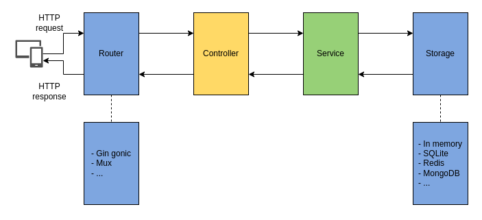

# Fizz-Buzz

A simple fizz-buzz REST server.

### Use cases
The original fizz-buzz consists in writing all numbers from 1 to 100, and just replacing all multiples of 3 by "fizz", all multiples of 5 by "buzz", and all multiples of 15 by "fizzbuzz". The output would look like this: "1,2,fizz,4,buzz,fizz,7,8,fizz,buzz,11,fizz,13,14,fizzbuzz,16,...".

The goal is to implement a web server that will expose a REST API endpoint that:

Accepts five parameters : three integers int1, int2 and limit, and two strings str1 and str2.

Returns a list of strings with numbers from 1 to limit, where: all multiples of int1 are replaced by str1, all multiples of int2 are replaced by str2, all multiples of int1 and int2 are replaced by str1str2.

The server needs to be:

Ready for production

Easy to maintain by other developers

- Add a statistics endpoint allowing users to know what the most frequent request has been.

This endpoint should:

- Accept no parameter

- Return the parameters corresponding to the most used request, as well as the number of hits for this request"

## Getting started

To run the program follow the instructions below.

```
git clone git@github.com:zatamine/fizz-buzz.git

cd fiz-buzz

make run

```

Result `2022/03/14 06:52:06 GIN HTTP server running on port ':8080'`

By default the program use the "localhost" host local machine and port "8080", take care that the port is not used.

Request example:

```
curl "http://localhost:8080/fizz-buzz?int1=3&int2=5&limit=200&str1=fizz&str2=buzz"
```

Response example:

```
{"body":"1,2,fizz,4,buzz,fizz,7,8,fizz,buzz,11,fizz,13,14,fizzbuzz,16,17,fizz,19,buzz,fizz,22,23,fizz,buzz,26,fizz,28,29,fizzbuzz,31,32,fizz,34,buzz,fizz,37,38,fizz,buzz,41,fizz,43,44,fizzbuzz,46,47,fizz,49,buzz,fizz,52,53,fizz,buzz,56,fizz,58,59,fizzbuzz,61,62,fizz,64,buzz,fizz,67,68,fizz,buzz,71,fizz,73,74,fizzbuzz,76,77,fizz,79,buzz,fizz,82,83,fizz,buzz,86,fizz,88,89,fizzbuzz,91,92,fizz,94,buzz,fizz,97,98,fizz,buzz"}
```

List of useful command line.

```
$ make lint  # Run a static analysis
$ make run   # To compiles and runs the package
$ make test  # Run unit and integration tests with coverage
$ make build # Build the programe on '/tmp/fizz-buzz'
```

## Endpoints rest API

| Endpoint         | HTTP method | status code | Parameters           | Description                                                  |
| ---------------- | ----------- | -------------------- | ------------------------------------------------------------ | ------------------------------------------------------------ |
| /fizz-buzz       | GET      | 200       | int1, int2, limit, str1, str2 | All paramter are mondatory;  int1, int2 and limit are integers; str1 and str2 are strings. |
| /fizz-buzz/stats | GET      | 200       |                      | Get a list of all statistics ordered by the most used request. |

## Architecture

To write this program I used some techniques and principles of software engineering, like [dependency injection](https://en.wikipedia.org/wiki/Dependency_injectioninterfaces) , [Dependency inversion principle](https://en.wikipedia.org/wiki/Dependency_inversion_principle), Interfaces, ...

And a flat architecture inspired from [The Clean Architecture](https://blog.cleancoder.com/uncle-bob/2012/08/13/the-clean-architecture.html) that allows us to (I quote):

1. Independent of Frameworks. The architecture does not depend on the existence of some library of feature laden software. This allows you to use such frameworks as tools, rather than having to cram your system into their limited constraints.
2. Testable. The business rules can be tested without the UI, Database, Web Server, or any other external element.
3. Independent of UI. The UI can change easily, without changing the rest of the system. A Web UI could be replaced with a console UI, for example, without changing the business rules.
4. Independent of Database. You can swap out Oracle or SQL Server, for Mongo, BigTable, CouchDB, or something else. Your business rules are not bound to the database.
5. Independent of any external agency. In fact your business rules simply don’t know anything at all about the outside world.


